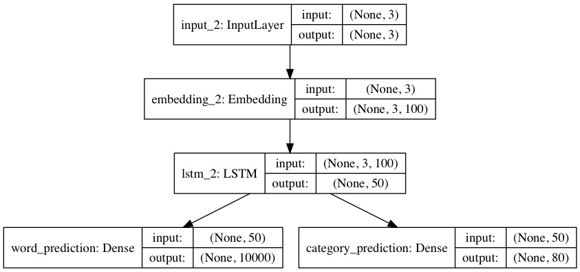
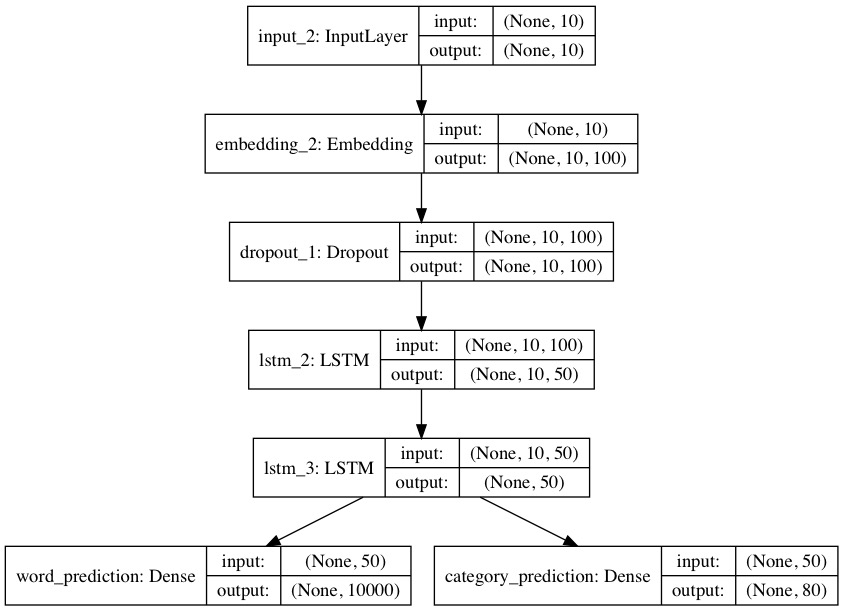
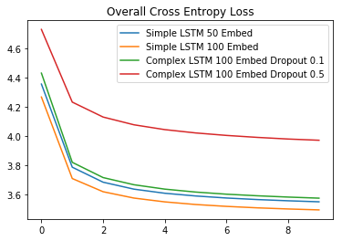

# LT2316 H18 Assignment 2

## Usage 

### `test.py`
```
# Example
python test.py -P B --windowsize=3 --maxinstances=10 ./models/lstm_simple.hdf5 tokenizer10000.pickle
```

### `perplexity.py`
```
# Example
python perplexity.py --windowsize=3 --maxinstances=10 ./models/lstm_simple.hdf5 tokenizer10000.pickle
```


###  Model Diagram


```python
from keras.models import load_model
from keras.utils import plot_model

model = load_model('./models/lstm_simple_embed100.hdf5')
plot_model(model, to_file="./imgs/lstm_simple_embed100.jpg", show_shapes=True)
```

    Using TensorFlow backend.




### Architecture Overview

After experiementing with many different architectures and LSTM layers, what ended up working the best was a single LSTM layer with 50 nodes. Each word is represented as an integer less than 10000. Some of the other approaches I tried were to have the embedding layer input into two different LSTM layers which in turn seperately predicted either word prediction, or category prediction. This performed worse than other options as well. The other architectures I experimented with are described below, where two LSTM layers are used (passing sequences from first to the second). 

  - **Loss function**: Categorical Cross Entropy
  - **Batch Size**: 256
  - **Epochs**: 10 (For final test)
  - **Window size**: 10 This was probably way overkill for this. I had slightly better results using 10 window size but the different in training time was not worth the results.
  - **Data size**: Using the window size of 10, I created 5572508 training examples from the 591753 captions in the training data. In the test set, 236352 training examples were created from 25014 captions.
  - **Dropout**: dropout was set to 0.1 for the LSTM layer. This performed better than no dropout and 0.5 dropout.


```python
# Alternative model
model = load_model('./models/lstm_complex_drop1.hdf5')
plot_model(model, to_file="./imgs/lstm_complex_drop1.jpg", show_shapes=True)
```

### Variant


This architectural variant did not seem to perform as well at the simple one layer LSTM model. I experimented with setting the dropout rate which increased the loss. This might not have been fair to do, since I did not run it for many epochs. Increasing the dropout rate should make the model converge slower but overfit less often which I didn't give it the chance to do with such a small number of epochs.

### Hyperparameter Selection  
  
  After experiementing with many different architectures and LSTM layers, what ended up working the best was a single LSTM layer with 50 nodes. I first changed the embedding size to 100 and then for the two other variations a more complex model (seen above) with additional dropout at levels 0.1 and 0.5. I thought that adding another LSTM layer would perform better than the single layer. I am not sure if increasing the epochs or modifying the other hyperparameters would have made a difference.
  
### Model Loss for Different Hyperparameters
  


### Lessons Learned

I learned lots about language models from building this word and category prediction. Also this project was a nice introduction to the Keras functional API. It was interesting to experiment with branching into two seperate LSTM models and combining at the end. The functional API is very simple to use and extremely powerful for branching and rejoining different layers. While Keras makes it easy to train complex models, I would like to dig more deep into some of the theory behind the different layers, and the reasoning behind various hyperparameters. 

This project also taught me the importance of starting early on projects. Both the preprocessing of the data and the training time resulted in many hours of debugging and waiting. The process of preparing the text data was challenging but can be easily used for other word based models I use in the future. I would definitely use a smaller window size for prediction and systematically increase it rather than jumping to something high. This would give me the opportunity to experiment more with other hyperparameters because it would reduce the amount of training time. Such as, increasing the dropout rate should make the model converge slower but overfit less often which I didn't give it the chance to do with such a small number of epochs.

### Why is it bad to validate/test on the training data?

It is bad to validate and test on the training data as we will tend to overfit when we eventually was to predict the test set. If we tweak the model too much while validating on the training data we will be not only overfitting in the model, but we will be human overfitting the data by modifying the model. Having a few hypothesis before hand and testing them out would be a better options
